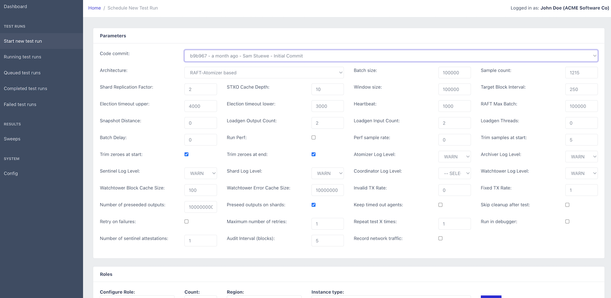

# Introduction

This repository includes the system used for benchmarking [opencbdc-tx](https://github.com/mit-dci/opencbdc-tx): the core transaction processor for a hypothetical, general purpose central bank digital currency (GPCBDC). It can be used to re-run the benchmarks that were the inputs to the evaluation section of the [research paper](https://dci.mit.edu/opencbdc)

OpenCBDC Test Controller was developed to enable large-scale multi-machine benchmarks in a realistic network environment, with geo-replicated instances. The foundation is running short-lived tests that spin up infrastructure, run the test, copy instrumentation data and then shut down. The OpenCBDC Test Controller is currently tailored to running inside an [Amazon Web Services (AWS)](https://aws.amazon.com) cloud infrastructure.

In order to deploy the OpenCBDC Test Controller and reproduce the test results presented in the paper, you will need to use the instructions in the [opencbdc-terraform](/) repository. This repository contains the IaC (Infrastructure as Code) that is necessary to run opencbdc-tx in the configuration we used to benchmark it. This module developed in [Terraform](https://www.terraform.io/), will take care of deploying the OpenCBDC Test Controller alongside the supporting infrastructure including, but not limited to EC2 Launch Templates, VPC Networks, EFS Volumes, S3 Buckets.

Without having these specific infrastructure configurations in place, the OpenCBDC Test Controller cannot function correctly.

# Reproducing our test results

Once you have deployed the OpenCBDC Test Controller in AWS using the instructions from the [opencbdc-terraform](/) repository, you will be able to access the OpenCBDC Test Controller from its web-based front-end:


The plots we present in the research paper are based on multiple test runs - each plot point represents three test runs. Before going over how to run an entire plot worth of tests, let's focus on running a single test:

## Running a single test

As stated in the previous paragraph, you can run a single test to reproduce the throughput and latency figures of a single plot point. As an example, let's take the throughput plot for the Atomizer architecture from the paper, and re-run the circled plot point:


This is the throughput of the Atomizer architecture using the following system components:

- 1 archiver
- 3 atomizers
- 8 watchtowers
- 8 logical shards (replication factor 2)
- 24 sentinels
- 24 load generators

Here's how we would schedule this test as a user. Firstly, we select the option `Start new test run` in the left sidebar of the UI. This will bring up the following screen:



In the `Parameters` section of this screen, you can see a great number of parameters that the system can be configured with. The default values are the values used for the scalability benchmarks in the paper, so we can leave them untouched for now. Other benchmarks from the paper such as the ones demonstrating the effect of increased double spends, different UTXO set sizes, the effects of having many inputs or many outputs in transactions, can be reproduced with some of these parameters altered. The exact purpose for each parameter is shown when hovering over the parameter name (TODO!).

In the next section, titled `Roles` we will have to decide on the roles we want to run, which instance type (launch template) to use for them, and where to run them geographically. For reproducing the paper plot point, we will compose the system as follows:

- Archiver - 1 - all - c5n.large
- Atomizer - 3 - all - c5n.2xlarge
- Sentinel - 24 - all - c5n.large
- Shard - 16 - all - c5n.2xlarge
- Watchtower - 8 - all - c5n.2xlarge
- Watchtower CLI - 24 - all - c5n.large

Once you have applied those role configurations, the `Roles` section would look as follows:


For this single test, we won't need to worry about the `Failures` or `Parameter Sweep` sections, so we can just hit the `Schedule` button at the bottom of the screen.

We will land in the `Test runs (running)` section of the controller, which will show us our running test run:


If you click the `Details` button on the right side of the table for the test run, you can see more details on what's going on with it:


### Test Results

Once a test run has run to completion, opening the test run details will yield a new section on the top showing the latency and throughput results, as interpreted from the raw samples copied from the agents:


### Performance data

For every test run, the agents that execute the binaries that are part of the system, monitor five performance metrics:

* CPU usage on the system
* Memory usage on the system
* Network buffer size
* CPU usage of the monitored process
* Thread count of the monitored process

These metrics are available under the **Performance Data** tab once the test run has completed


Clicking on a performance plot will open it separately in a new tab/window

### Perf tracing

You can enable **Run perf traces** on a test run, and set the sample rate. This will add additional instrumentation to your test run, and allows you to generate flame graphs of the processes that were ran as part of the test. This is helpful in finding performance bottlenecks in the system, but the binaries produced by the system will not be optimized and thus the overall performance of the system in these perf traced runs is generally (significantly) worse than when perf tracing is turned off.

The flame graph is also available under the **Performance Data** tab once the test run has completed, but only for perf traced test runs


Clicking on the flame graph will open it separately in a new tab/window and allow you to navigate and drill down.

## Re-running an entire benchmark plot

As stated before, an entire benchmark plot consists of multiple tests ran with a varying parameter. In case of the scalability plot showed before, the varying parameter is the number of clients sending transaction load to the system.

For this purpose, the ability to run role sweeps is included in the OpenCBDC Test Controller. In order to reproduce the single green line from the benchmark plot for 8 logical shards, here's how we configure the sweep. We start with the same configuration as under [Running a single test](#running-a-single-test), but we make a few alterations.

Firstly, we configure the test to be repeated three times, so that we run each test configuration three times and are able to produce error bars on our plot:


Next, under the `Roles` section, we reduce the number of Sentinels and Watchtower CLIs to be initially 6 each:


Lastly, we configure the role sweep to add 6 more Watchtower CLIs and 6 more Sentinels with each run, and configure a total of 6 runs. This will result in the system being run with 6, 12, 18, 24, 30, and 36 Sentinels/Watchtower CLIs, while all other parameters remain the same. The "Repeat test 3 times" configuration will ensure that each level of client load will be repeated three times.


Once we hit the Schedule button, we will see all of the tests being scheduled, and the scheduler in the OpenCBDC Test Controller will take care of executing each of the tests.


## Generating the plot

Once the full set of test runs in the Role Sweep has completed, we can view it in the list of Sweeps:


You can open a matrix with the test results by clicking on **Result Matrix**. This will show you a table containing the different system configurations that were part of the sweep, the number of times that configuration was run (`Result count`), and the averaged results over those runs for throughput and latency. There's also a button to download the matrix as a CSV for further analysis:


From the list of sweeps you can also open the Plot generator by clicking on the **Plots** button, which allows you to plot the various metrics of the system against, using the results from the parameter sweep.


Once you configured the plot and click "Create" the plot will be rendered on the fly and shown on the right half of the screen. If you want to save the plot for later, you can check the "Save" box which will result in the plot being retained and shown in the list of saved plots at the bottom of the screen.

# OpenCBDC Test Controller Architecture

The system consists of three major parts:

| Component   | Purpose                                       |
|-------------|-----------------------------------------------|
| Test coordinator | Server component that coordinates test runs and stores test results. Exposes a REST and Websocket API to give the frontend the ability to initiate new test runs and access test results. Has a TCP server for incoming connections from agents, which it can then provide source code to, ask to compile and run binaries, and send back output files once a test run is completed |
| Agent       | Client component that connects to the coordinator, and executes what the coordinator tells it to do. The agent also contains important instrumentation logic to capture things like CPU, Memory usage, Network buffer sizes to understand how the processes ran by the test controller perform. These instrumentation logs are also sent back to the controller upon completion of the test runs |
| Frontend    | Browser-based frontend to control the coordinator, follow the progress of test runs and browse test results |

# Technology

The agent and coordinator are written in Go. This results in the agent being a single binary (per architecture) to deploy on a target system and participate in a test run, which is highly preferable. The system can be used with both physical machines and AWS instances.

The frontend uses [React](https://reactjs.org/) and is based on [CoreUI](https://coreui.io/). Both these frameworks are MIT Licensed.

Main reason for this choice is to have a UI up and running quickly without much frontend development work. Given that the frontend and the coordinator are separated by a REST/WebSocket based API we can easily re-evaluate this choice at a later stage if something else is more desirable. The downside to React is generally the enormous dependency tree you inherit with it. But given the near-zero impact of this choice on the core system's architecture (the testing framework is entirely separate) this downside seems acceptable.

# Authentication

The server runs both an Unauthenticated and Authenticated endpoint (both HTTPS).

The REST endpoint run on the authenticated HTTPS endpoint that needs client-side certificates. The server will only grant access to clients with an authorized certificate. No usernames and passwords are needed - analog to key-based SSH authentication.

The unauthenticated endpoint contains the websocket endpoint - because [Safari does not support websockets with client-certificate](). The user obtains a token from the authenticated endpoint (with its client certificate) and can connect to the websocket endpoint by providing that token. Tokens are only valid for 5 seconds and are one-time use.

The unauthenticated endpoint further contains an `/auth` route that will explain the user how to generate a client-side certificate. Without this certificate you cannot access the main HTTPS frontend. Once you have generated your client-side private key and certificate and imported it into your browser, you have to provide the certificate to someone with access to the system. They can add your certificate to the list of authorized users - from which moment you can access the HTTPS portion of the frontend.

# Developing and debugging the coordinator locally (Docker)

For testing the system in a local environment, using [Docker](https://www.docker.com) is preferable. This allows you to run the coordinator in a container. However, even though the container runs locally, it would still rely on infrastructure components deployed in AWS using [opencbdc-terraform](/).

Here's how you build this system in a container:

```bash
git clone git@github.com:mit-dci/opencbdc-tctl
cd opencbdc-tctl
```

Now, you prepare the config folder:
```
mkdir docker-config
```

Next, generate an AWS credentials file that has access to the AWS account where you deployed the necessary infrastructure for the OpenCBDC Test Controller using the [opencbdc-terraform](/), and ensure it has the header `[default]` (so not `[12345678_AdminAccess]` or something similar). Place it in `docker-config/aws-credentials`.

Now, you can start up the system with

```bash
docker-compose up -d
```

Note that this will also trigger building the container

The coordinator should now be accessible via https://localhost:8444/auth.

Generate a certificate using the instructions on the page. Import the private key in your browser using the password provided by the console output, and then add the certificate in the UI as the first user. The confirmation page will show you a link to open the test controller's main UI at https://localhost:8443/ - make sure to pick the freshly imported client certificate to authenticate yourself.


